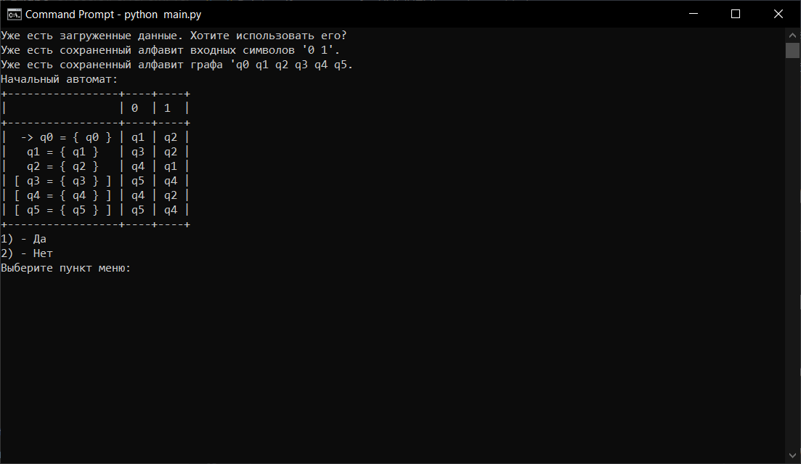
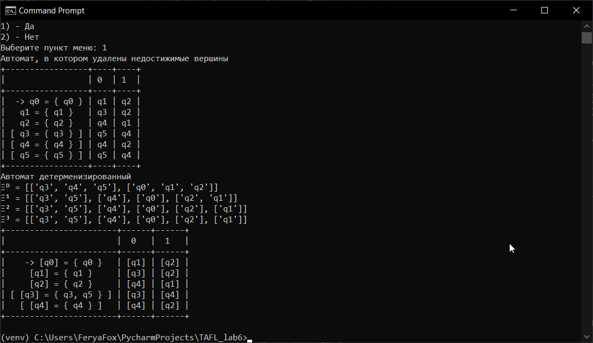

# Что за проект (RU)

Данный проект был создан, как лабораторная работа для университета по предмету "Теория автоматов и формальных языков".

Данный проект выполняет следующие пункты:

- Проверяет есть ли недостижимые вершины. Если такие есть, то удаляет их
- Проверяет детерминированный ли автомат. Если нет, то детерминизирует его
- Разбивает на классы эквиваленции

# Зависимости

Установка `pip install -r requirements.txt`

Есть необязательная зависимость `simple_term_menu` и служит только для красивого отображения меню. Работает только в Linux и только в терминале.

Если у вас другой случай, то будет работать более простое меню

# Запуск

`python main.py`

# Скриншоты

## Загрузка предыдущего состояния

### Linux

### Windows

## Основное задание

### Linux

### Windows

# What kind of project (ENG)

This project was created as a laboratory work for the university on the subject "Theory of automata and formal languages".

This project fulfills the following points:

- Checks if there are unreachable vertices. If there are any, then delete them
- Checks whether the automaton is deterministic. If not, then it determines it
- Breaks down into equivalence classes

# Dependencies

Installing `pip install -r requirements.txt`

This is an optional "simple term" function and only serves to briefly display information. It only works on Linux and only in the terminal.

If you have a different case, a simpler menu will work.

# Launch

`python main.py `

# Screenshots

## Loading the previous state

### Linux

### Windows

## The main task

### Linux

### Windows

